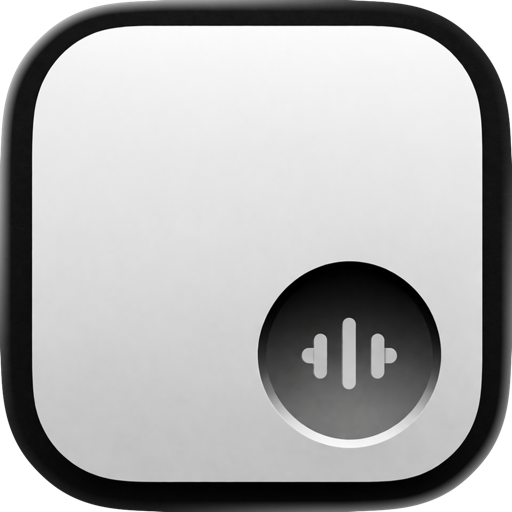
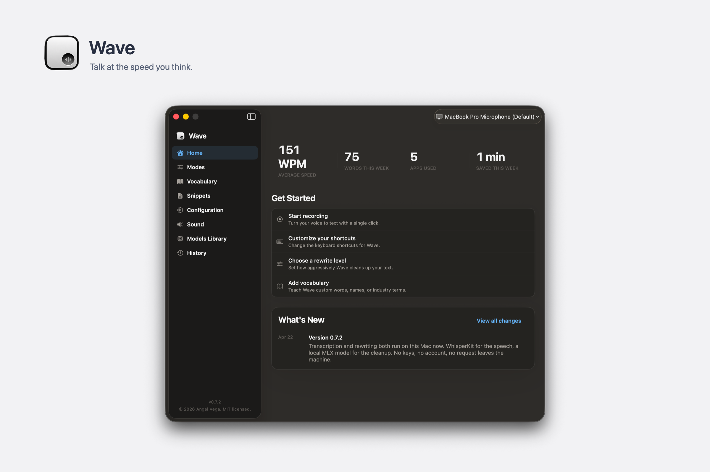
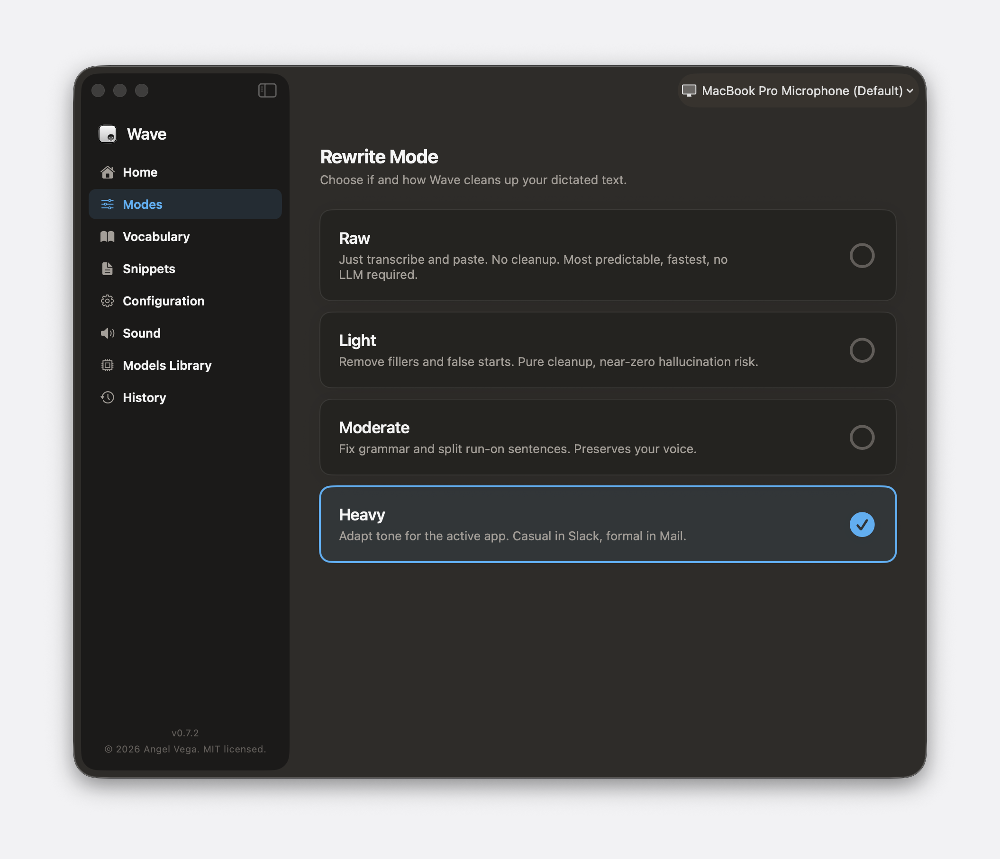
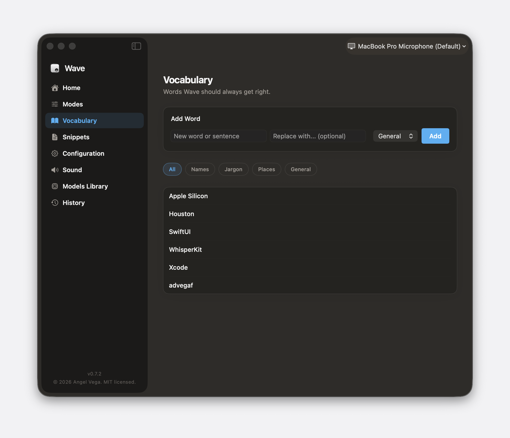
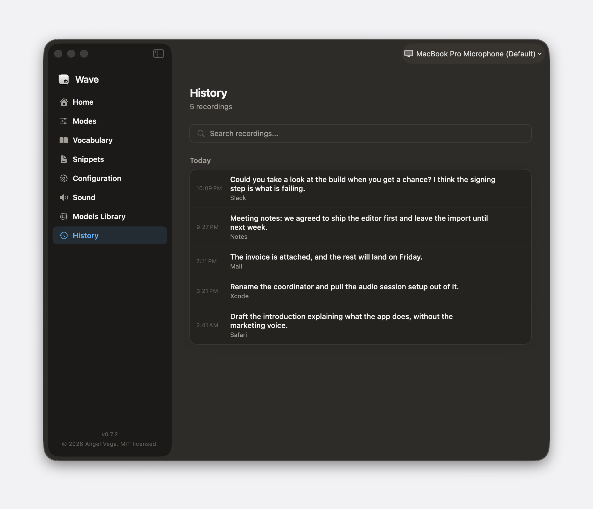

<p align="center">
  
</p>

<h1 align="center">Wave</h1>

<p align="center">
  Talk at the speed you think. Hold a key, say the thing, and clean text lands wherever the cursor already was. The speech and the cleanup both run on your Mac.
</p>

<p align="center">
  
</p>

<p align="center">
  <a href="https://github.com/advegaf/wave/releases/latest"></a>
</p>

<p align="center">
  <sub>Free, and nothing leaves the machine. Requires macOS 26 and Apple Silicon.</sub>
</p>

Dictation on a Mac has been the same trade for years. The built in one hears you
accurately and writes down every "um" and every sentence you started twice. The
good ones fix that by sending your voice to a server.

Wave takes the third option. Whisper hears you, and a small language model
tidies what it heard. Both run on this Mac, off files on your disk. There is no
account and no key to paste. The only time Wave uses the network is the first
download of a model; after that you can be offline and it still works.

Press Command Shift Space, talk the way you actually talk, press it again.
Escape throws the recording away. A waveform floats above the Dock while it
listens so you can see it is hearing you.

## Install

Open the disk image and drag Wave into Applications.

The build is signed ad hoc rather than with a Developer ID, so Gatekeeper will
refuse the first launch. Open System Settings, go to Privacy & Security, and
the note about Wave near the bottom has an Open Anyway button. That is once,
not every launch. Notarized builds are the plan; they are not what ships today.

Requires macOS 26 and an Apple Silicon Mac.

## How much it rewrites is your call

<p align="center">
  
</p>

Raw pastes the transcript and nothing else. No model runs, so it is the fastest
and the only mode that cannot invent a word you did not say.

Light strips the fillers and the false starts. Moderate fixes grammar and cuts
run on sentences apart while leaving your phrasing alone. Heavy reads which app
is in front and matches it, so the same sentence comes out casual in Slack and
formal in Mail.

All four are in the menu bar popover, and a shortcut cycles them without
opening anything. The mode you leave it on is the mode it uses next time.

## Words it keeps getting wrong

<p align="center">
  
</p>

Every transcriber mangles the same handful of words: your surname, the name of
the thing you are building, whatever your team calls the staging environment.
Add them here, under Names, Jargon, Places or General, and give a replacement
if the spelling out loud is not the spelling on the page.

Snippets are the other half of it. Give a phrase you would actually say, pair
it with the text it should become, and saying the phrase pastes the text.

## Everything it wrote down

<p align="center">
  
</p>

Every transcription is kept, searchable, with the app it went into. It is a
local SQLite file. Nothing syncs it anywhere.

## Models

Whisper base handles the speech. For the rewrite, the Models Library carries
five local models in MLX format: Llama 3.2 at 1B and 3B, Qwen 3 at 4B and 8B,
and Phi 3.5 Mini, which is the default because it is the best trade between
what it costs in memory and how well it follows an instruction. Each card
shows what it will take on disk and in RAM before you install it.

## Permissions

| What you use | What it asks for | Why |
| --- | --- | --- |
| Recording anything | Microphone | It is a dictation app |
| Pasting the result | Accessibility | The paste is a synthesised Command V, and posting keystrokes needs it |

macOS grants these to a signed copy of an app rather than to its name, so a
Wave you built yourself and a Wave from the release are two different apps as
far as the permission is concerned. If Wave is already listed and still says it
has no permission, switch that row off and on again.

Nothing else is asked for. There is no analytics, no account, and no server
that belongs to Wave.

## Build it yourself

```sh
brew install xcodegen
xcodegen generate
xcodebuild -project Wave.xcodeproj -scheme Wave -configuration Debug build
```

`Tools/Screenshots/make-docs-images.sh` regenerates every image on this page.
It launches the app under `WAVE_DEMO=curated`, which points the database at a
throwaway file seeded with fixtures, so a capture never photographs whatever
you have actually dictated.

## Credit

Built by [Angel Vega](https://github.com/advegaf).

Speech recognition is [WhisperKit](https://github.com/argmaxinc/WhisperKit).
The rewrite runs on [MLX Swift](https://github.com/ml-explore/mlx-swift).
Speech detection is Silero through
[FluidAudio](https://github.com/FluidInference/FluidAudio).

## Licence

MIT. See [LICENSE](LICENSE).
